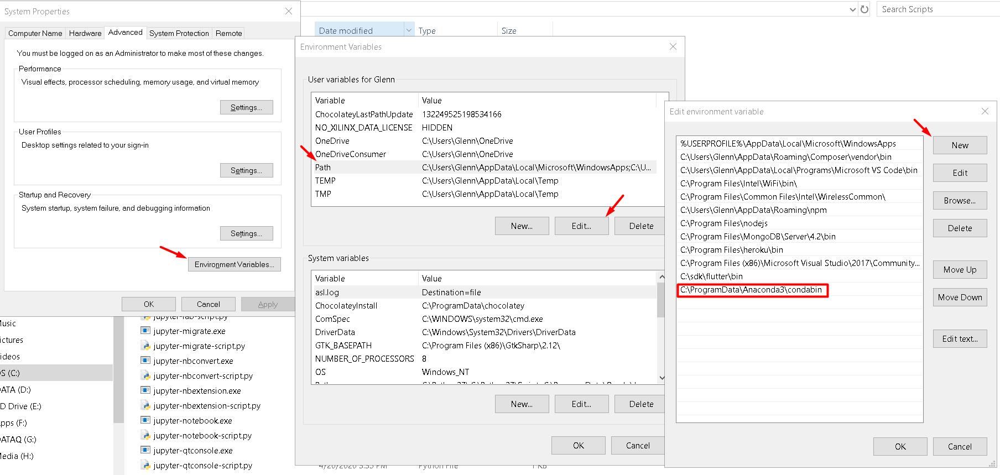
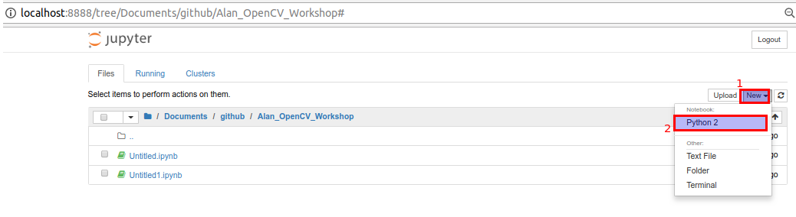
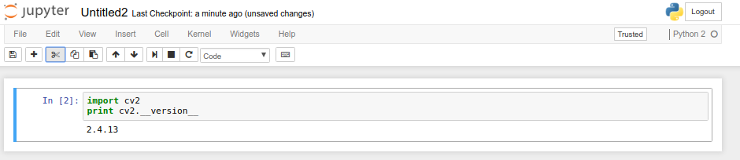

**STEP 1** - Download & Install Anacondan Python Package
- Pergi ke https://www.anaconda.com/download/
- Pilih Anaconda2/3
- Install dan jangan lupa menambahkan path instaasi anaconda ke environment variable windows / linux

**STEP 2** - Setup Environment
- Copy path instalasi script anaconda `` C:\ProgramData\Anaconda3\Scripts `` & `` C:\ProgramData\Anaconda3\Library\bin ``


**STEP 3** - Download dan Install OpenCV
- buka cmd dan ketikkan
```bash 
pip install opencv-contrib-python
```
**NOTES** - Jika anda mendapati masalah ketika instalasi opencv
- Perbarui OpenSSL di https://slproweb.com/products/Win32OpenSSL.html
- Jika ada masalah ketika import cv2 lakukan update numpy dengan
``
pip install -U numpy
``

**STEP 3** - Verifikasi



 **STEP 4** - Clone project  
 - Jangan lupa clone projek ini, jika anda sudah mempunyai git 
 ``` bash 
 git clone https://github.com/alanyukeroo/Motion-and-Object-Tracking-Workshop/ 
 ```


